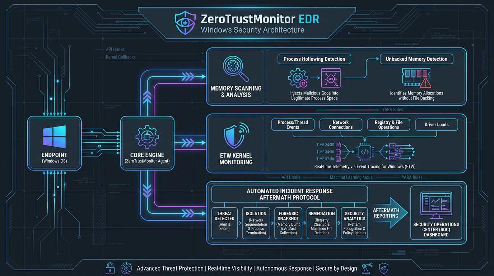

# ZeroTrustMonitor EDR



**ZeroTrustMonitor** is a lightweight, high-performance Endpoint Detection and Response (EDR) agent built natively in C# for Windows. Operating on a strict **Zero-Trust** security architecture, it provides real-time visibility, process hollowing detection via kernel-level memory scanning, ETW threat hunting, and automated incident response mitigation.

---

## 🚀 Key Features

* **Memory Hollowing Detection (Unbacked Executable Memory):**
  Uses `VirtualQueryEx` and `GetMappedFileName` to inspect process address spaces in RAM, detecting executable (`MEM_COMMIT`) regions lacking disk file backing (unbacked memory)—the definitive signature of Process Hollowing and code injection attacks.
* **Kernel-Level Telemetry via ETW:**
  Monitors process launches, parent-child process hierarchy violations, and malicious command-line parameters in real time using Event Tracing for Windows (`TraceEventSession`).
* **Automated Aftermath Incident Response:**
  * **Payload Dump:** Extracts unbacked memory payloads (`ReadProcessMemory`) directly to `.bin` files for forensic analysis before termination.
  * **Parent Process Tracing:** Identifies and terminates dropper parent processes via WMI (`Win32_Process`).
  * **Persistence Hunting:** Scans startup registry keys (`HKCU\...\Run`) to prevent malware survival across reboots.
  * **Network Isolation:** Simulated network firewall quarantine to prevent lateral movement.
* **Timeframe-Based Threat Hunting:**
  Supports scanning processes started within specific timeframes (Last 10m, 30m, 1h, Today, or Since System Boot).

---

## 📊 System Architecture

```
+-----------------------------------------------------------------------+
|                         ZeroTrustMonitor EDR                          |
+-----------------------------------------------------------------------+
|  [1] Event Tracing for Windows (ETW)                                  |
|      └── Real-time Parent-Child Process Hierarchy Monitoring          |
|                                                                       |
|  [2] Unbacked Executable Memory Scanner                               |
|      ├── VirtualQueryEx -> Identify MEM_COMMIT Executable Pages       |
|      └── GetMappedFileName -> Flag allocations without file backing   |
|                                                                       |
|  [3] Incident Response Aftermath Engine                               |
|      ├── ReadProcessMemory (Dump decrypted RAM payloads)              |
|      ├── WMI Parent Process Termination                               |
|      ├── Registry Persistence Audit                                   |
|      └── Network Isolation Protocols                                  |
+-----------------------------------------------------------------------+
```

---

## 🛠️ Building & Running

### Prerequisites
* Windows 10 / 11 or Windows Server 2019+ (x64 / ARM64)
* .NET 10.0 SDK

### Build Executable
```bash
dotnet build -c Release
```

### Run (Requires Administrator Privileges)
```bash
dotnet run
```

---

## 📜 License

Licensed under the [Apache License, Version 2.0](LICENSE).
